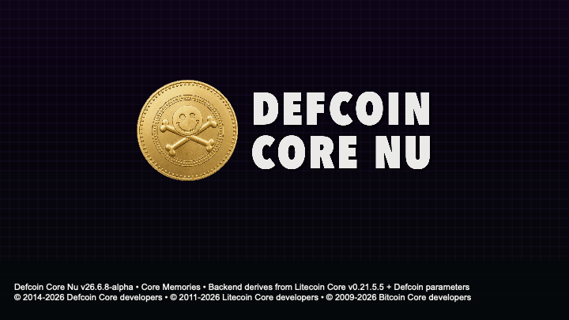
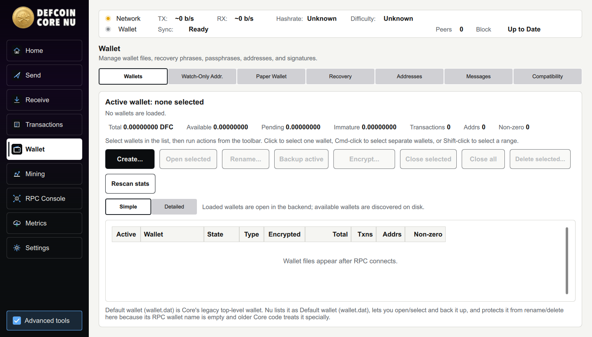
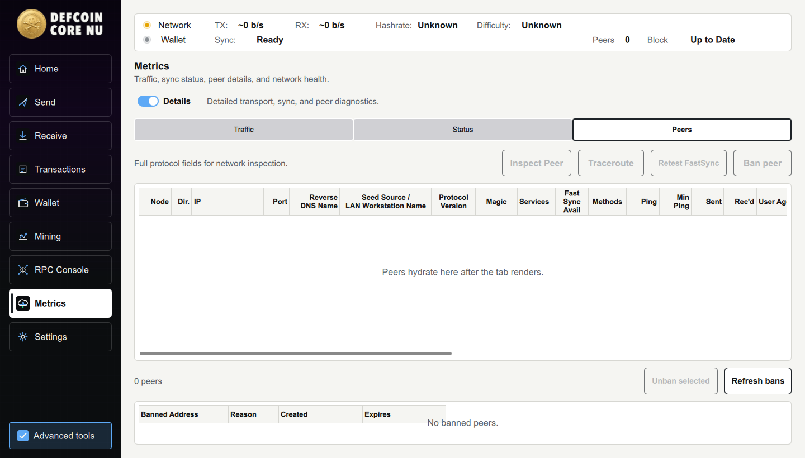

<p align="center">
  
</p>

<h1 align="center">Defcoin Core Nu</h1>

<p align="center">
  <strong>Full-node Defcoin wallet with local network tools, paper wallets, recovery workflows, peer diagnostics, and modern wallet management.</strong>
</p>

<p align="center">
  <a href="https://github.com/defcoincore/Defcoin-Core-Nu/releases/tag/v26.6.8-alpha"><strong>Download v26.6.8-alpha</strong></a>
  ·
  <a href="#build-from-source">Build from source</a>
  ·
  <a href="source/doc/defcoin-core-nu-technical-guide.md">Technical guide</a>
  ·
  <a href="source/doc/defcoin-nu-architecture.md">Architecture</a>
  ·
  <a href="source/src/qt/nu/docs/release-notes-26.6.8-alpha.md">Release notes</a>
</p>

Defcoin is a Scrypt proof-of-work cryptocurrency with a long-running independent
chain. Defcoin Core Nu is the current desktop full-node wallet for holding DFC,
sending and receiving payments, managing local wallets, inspecting peers, and
participating in the Defcoin network.

`26.6.8-alpha`, codename `Core Memories`, is the current public alpha release.
The current Tahoe / Apple Silicon candidate is `26.6.8l-alpha`. It preserves
Defcoin's historical chain rules and wallet data while adding a modern Qt Quick
desktop experience for macOS Apple Silicon and Windows 11.

## Get The Current Alpha

Download packages from
[Defcoin Core Nu v26.6.8-alpha](https://github.com/defcoincore/Defcoin-Core-Nu/releases/tag/v26.6.8-alpha).

| Platform | Package |
| --- | --- |
| macOS Apple Silicon / Tahoe | [Nu DMG](https://github.com/defcoincore/Defcoin-Core-Nu/releases/download/v26.6.8-alpha/Defcoin-Core-Nu-v26.6.8l-alpha-macOS-AppleSilicon-Tahoe.dmg) |
| OS X Lion 10.7 | [Nu DMG](https://github.com/defcoincore/Defcoin-Core-Nu/releases/download/v26.6.8-alpha/Defcoin-Core-Nu-26.6.8-alpha-osx107.dmg) |
| Windows 11 x86_64 | [Nu Installer](https://github.com/defcoincore/Defcoin-Core-Nu/releases/download/v26.6.8-alpha/Defcoin-Core-Nu-v26.6.8e-alpha-Windows-11-x86_64-Setup.exe) |
| Windows 11 x86_64 | [Nu Portable ZIP](https://github.com/defcoincore/Defcoin-Core-Nu/releases/download/v26.6.8-alpha/Defcoin-Core-Nu-v26.6.8e-alpha-Windows-11-x86_64-Portable.zip) |
| Verification | [SHA256SUMS.txt](https://github.com/defcoincore/Defcoin-Core-Nu/releases/download/v26.6.8-alpha/SHA256SUMS.txt) |

This is an alpha prerelease. The macOS Apple Silicon DMGs are ad-hoc signed and
not notarized; Windows packages are not Authenticode-signed. Back up wallets
before testing new builds, especially when opening older wallet files.

After installing, start Nu, allow it to connect to peers, and let the node sync
before relying on balances or recent transactions.

## What Nu Adds

- A Qt Quick desktop shell for Home, Send, Receive, Transactions, Wallet,
  Mining, RPC Console, Metrics, and Settings.
- Managed local `defcoind` startup for packaged desktop builds, plus a bundled
  `defcoin-cli` for advanced local support and RPC diagnostics.
- Wallets management with legacy Berkeley DB wallets and modern SQL descriptor
  wallets shown side by side, including active wallet totals, transaction
  counts, address counts, non-zero address counts, backups, encryption, and
  wallet close/open actions.
- BIP39 recovery phrase creation and restore workflows, optional SQL descriptor
  recovery, passphrase quality feedback, passphrase visibility controls, and
  zero-balance scan options for slower but cleaner recovery imports.
- Paper Wallet generation with local key/address derivation, BIP38 passphrase
  handling, print and preview controls, entropy safeguards, and the release-gated
  Design 1 output.
- Send-path hardening for depleted keypool/change-address errors: Nu can refill
  the keypool and retry when the backend reports that a change address cannot be
  generated.
- Peer and network diagnostics with observed magic bytes, protocol version,
  services, User-Agent, seed-source attribution, DNS names, IPv6 display, traffic
  metrics, peer inspection, selectable/copyable inspection text, bans, and
  Trippy route tracing when available.
- A restored Debug Log surface under the RPC Console area with line-numbered log
  inspection alongside the RPC command console.
- Block explorer presets for Defcoin services, including transaction and
  address URL templates.
- Local mining setup and monitoring helpers that let users select an external
  miner executable rather than bundling mining code inside the wallet.
- Defcoin network migration support: upgraded peers use `defc014e`; compatibility
  mode can still accept legacy `fbc0b6db` before defcoin-only enforcement.
- Defcoin User-Agent filtering using the `/Defcoin` prefix rule to reduce
  Litecoin-family peer pollution.
- Receive request history, PSBT handling, message signing guidance, wallet
  backup, encryption, and passphrase flows.

## Screenshots

<p align="center">
  
</p>

<p align="center"><em>Wallets management with wallet stats, encryption, backups, watch-only tooling, and scroll-visible wallet tables.</em></p>

<p align="center">
  
</p>

<p align="center"><em>Peer diagnostics layout with columns for seed-source attribution, DNS names, observed magic bytes, services, FastSync availability, and latency.</em></p>

<p align="center">
  
</p>

<p align="center"><em>Defcoin Core Nu About and splash graphic with the current Nu identity.</em></p>

## Network Identity

| Item | Value |
| --- | --- |
| Proof of work | Scrypt |
| Target block time | 2 minutes |
| Mainnet P2P/RPC ports | `1337` / `9332` |
| Mainnet Defcoin magic | `de fc 01 4e` (`defc014e`) |
| Mainnet legacy magic | `fb c0 b6 db` (`fbc0b6db`) |
| Defcoin-only magic enforcement | August 1, 2026 |
| Config file | `defcoin.conf` |
| macOS data directory | `~/Library/Application Support/Defcoin/` |

More detailed chain, seed, wallet, and compatibility notes are in the
[Defcoin Core Nu Technical Guide](source/doc/defcoin-core-nu-technical-guide.md).

👉 [Defcoin Core Nu Architecture & Upstream Litecoin v0.21.5.5 Comparison](source/doc/defcoin-nu-architecture.md)

## Build From Source

Start with a fresh clone:

```text
git clone https://github.com/defcoincore/Defcoin-Core-Nu.git
cd Defcoin-Core-Nu
cd source
```

The buildable Litecoin-derived source tree is intentionally kept under
`source/` so the GitHub root can work as a clean product landing page.

Platform prerequisites are documented here:

- [macOS Build Notes](source/doc/build-osx.md)
- [Unix Build Notes](source/doc/build-unix.md)
- [Windows Build Notes](source/doc/build-windows.md)
- [Defcoin Core Nu Technical Guide](source/doc/defcoin-core-nu-technical-guide.md)

Release artifacts are attached to GitHub Releases rather than committed to
source history.

## Compatibility

Defcoin Core Nu preserves Defcoin's historical mainnet behavior first. It keeps
legacy Base58 wallet compatibility and does not treat newer Litecoin mainnet
deployments as active Defcoin mainnet consensus features unless they are
explicitly part of Defcoin.

Back up old wallets before testing them with new software.

## License And Notices

Defcoin Core Nu code is released under the MIT license inherited from Litecoin
Core and Bitcoin Core. See [COPYING](COPYING).

Trademark rights and coin artwork permissions are separate from the software
license. See
[license and attribution notices](source/doc/license-and-attribution-notices.md).

Copyright (C) 2014-2026 The Defcoin Core developers.

Defcoin Core is derived from Litecoin Core and Bitcoin Core. Portions remain
credited to The Litecoin Core developers and The Bitcoin Core developers.
