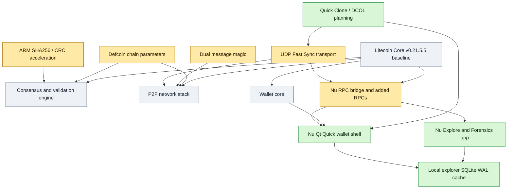
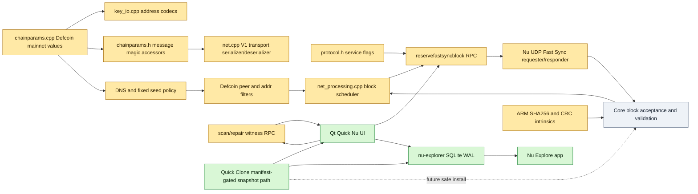

# Defcoin Core Nu Architecture And Upstream Litecoin v0.21.5.5 Comparison

This document compares the current Defcoin Core Nu source tree with the exact
upstream Litecoin Core `v0.21.5.5` tag. The comparison was built from a local
export of that tag and a structural scan of the Defcoin Core Nu workspace. It
focuses on source-level behavior: consensus parameters, network identity,
transport changes, wallet-facing additions, and the Nu Qt Quick application
layer.

## 1. Executive Summary of Defcoin Core Nu

Defcoin Core Nu is a Defcoin full-node wallet and desktop application that
derives from Litecoin Core v0.21.5.5 while preserving Defcoin's historical chain
rules, peer compatibility, wallet data, and Scrypt proof-of-work network. The
latest source tree keeps the inherited validation engine as the safety boundary
and layers Nu-specific networking, diagnostics, wallet UX, and local analytics
around it.

Core differentiators relative to upstream Litecoin Core v0.21.5.5:

- Defcoin-specific mainnet identity: genesis block, message magic, default
  ports, DNS seeds, address prefixes, Bech32 HRPs, chain work, and soft-fork
  activation boundaries are replaced in `src/chainparams.cpp`.
- Historical Defcoin mainnet rules are prioritized over newer Litecoin mainnet
  activations: Taproot and MWEB are configured as never active on Defcoin
  mainnet, while legacy Defcoin SegWit, CSV, BIP34, BIP65, and BIP66 heights are
  explicit.
- Dual P2P message magic supports migration from legacy `fbc0b6db` peers to
  Defcoin-specific `defc014e` peers without forcing old nodes off the network.
- Peer selection and address relay are hardened for a small Defcoin network by
  preferring Defcoin ports/seeds and filtering non-Defcoin peer pollution.
- `NODE_DEFCOIN_FASTSYNC` service bit 29 advertises optional checksum-protected
  UDP Fast Sync capability without changing consensus.
- Fast Sync is implemented as a transport optimization: Core still selects and
  reserves the peer/block pair, and received blocks still enter the normal Core
  validation path.
- Quick Clone/DCOL is kept separate from Fast Sync. It is the trusted-LAN
  snapshot direction for public chain data only and is intentionally
  manifest-gated before live chainstate replacement.
- Nu adds a Qt Quick desktop shell, bundled backend launch orchestration, RPC
  console, Metrics, LAN discovery, mining helper UI, wallet recovery flows, and
  an adjunct Explore/Forensics app surface.
- The local explorer/forensics database is a separate SQLite WAL cache under
  `nu-explorer/explorer.sqlite`; it is not the wallet database and does not
  store private keys.
- Apple Silicon builds can use ARM SHA256 and CRC32C intrinsics for validation
  hot paths when the compiler and target support them.

## 2. Differential Logic Breakdown (Litecoin v0.21.5.5 Baseline vs. Defcoin Core Nu)

### Consensus And Chain Parameters

The largest consensus-facing fork is `src/chainparams.cpp`. Defcoin Core Nu
keeps the Litecoin/Bitcoin validation framework but swaps the active chain
identity:

- Mainnet proof-of-work target spacing is `2 * 60` seconds with a one-day
  retarget timespan.
- Mainnet subsidy halving interval is `840000`.
- Mainnet SegWit and CSV activate at height `903168`.
- Mainnet BIP34 activates at height `828326` with hash
  `57bae90a3342fac0bae15eb2ac9a8924779984bc301ae67730dfda6df49b203c`.
- Mainnet BIP65 and BIP66 activate at height `1828326`.
- Mainnet Taproot and MWEB deployments are set to never active.
- Mainnet pow limit is
  `00000fffffffffffffffffffffffffffffffffffffffffffffffffffffffffff`.
- Mainnet minimum chain work is
  `0x0000000000000000000000000000000000000000000000000001000000000000`.
- Mainnet default assume-valid is empty, forcing local validation rather than a
  Litecoin inherited assume-valid anchor.

The mainnet identity values are Defcoin-specific:

- Genesis: time `1394002925`, nonce `386295993`, bits `0x1e0ffff0`, reward
  `50 * COIN`.
- Genesis block hash:
  `192047379f33ffd2bbbab3d53b9c4b9e9b72e48f888eadb3dcf57de95a6038ad`.
- Genesis merkle root:
  `7294da28c1b8eeba868388b14e2205874fb512f0ca31c2f583002557175f2c9c`.
- Default mainnet P2P port: `1337`.
- Mainnet legacy magic: `fb c0 b6 db`.
- Mainnet Defcoin-specific magic: `de fc 01 4e`.
- Mainnet Base58 prefixes: pubkey `30`, script `5`, secondary script `50`,
  secret key `176`, xpub `0488b21e`, xprv `0488ade4`.
- Mainnet Bech32 HRPs: `dfc` and `dfcmweb`.
- Mainnet DNS seeds include `seed.defcoin.io`, `seed.defcoin.mikej.tech`,
  `seed.defcoin.dc903.org:10332`, `seed.defcoincore.org`, and
  `seed.defcoin-ng.org`.

Related files:

- `src/chainparams.cpp`
- `src/chainparams.h`
- `src/chainparamsbase.cpp`
- `src/chainparamsseeds.h`
- `src/consensus/params.h`
- `src/key_io.cpp`
- `src/policy/feerate.h`

### Network Identity, Peer Filtering, And Dual Magic

Nu adds explicit dual-magic support in `src/chainparams.h` and `src/net.cpp`.
`MessageStart()` remains stable for inherited storage paths, while live P2P
transport can choose either `MessageStartDefcoinMagic()` or
`MessageStartLegacyMagic()`.

Inbound message parsing in `V1TransportDeserializer::TrySelectMessageStart()`
accepts the Defcoin-specific magic and, when compatibility is enabled, the
legacy magic. Outbound peer creation prefers the Defcoin-specific magic but keeps
a bounded legacy probe path for old-only Defcoin peers.

Defcoin-specific network adaptations also include:

- Faster DNS seed retry behavior for a smaller live network.
- Explicit-host DNS seed handling, including `host:port` seeds.
- Fixed-seed fallback when peer coverage is low.
- Preferred Defcoin ports including default `1337` and alternate `10332`.
- Address-manager and relay filtering intended to reduce inherited
  Litecoin-family peer pollution.
- LAN/private address relay gating through `-allowlannodediscovery`.

Related files:

- `src/net.cpp`
- `src/net.h`
- `src/net_processing.cpp`
- `src/net_processing.h`
- `src/addrman.cpp`
- `src/addrman.h`
- `src/addrdb.cpp`
- `src/init.cpp`
- `src/protocol.cpp`
- `src/protocol.h`

### Fast Sync UDP Transport

Fast Sync adds a Defcoin-only service bit:

```cpp
NODE_DEFCOIN_FASTSYNC = (1 << 29)
```

The bit is declared in `src/protocol.h` and rendered as
`DEFCOIN_FASTSYNC` in `src/protocol.cpp`. It is advertised from `src/init.cpp`
only when `-defcoinfastsync` is enabled. That makes the bit a capability
signal, not a claim that a firewall or NAT currently permits UDP.

The important architectural point is that Fast Sync is a transport choice, not a
new block-selection or consensus path. `src/rpc/net.cpp` exposes
`reservefastsyncblock` with these actions:

- `reserve`
- `reserve-next`
- `release`
- `transport-verified`
- `transport-unverified`

Those RPCs call reservation helpers in `src/net_processing.cpp`:

- `ReserveFastSyncBlockInFlight`
- `ReserveNextFastSyncBlockInFlight`
- `ReleaseFastSyncBlockInFlight`
- `SetFastSyncPeerTransportVerified`

The reservation helpers check that the peer is connected, transport-verified,
able to serve the required data, and not already carrying the requested block
through normal Core in-flight tracking. Received Fast Sync blocks still flow
through normal block acceptance and validation.

The desktop transport orchestration lives in
`src/qt/nu/app/NuRpcService.cpp` and the server/sidecar reference lives in
`src/qt/nu/tools/defcoin_fast_syncd.py`. The protocol is documented in
`src/qt/nu/docs/fast-sync-protocol.md` with UDP port `10334`, datagram prefix
`DFCLAN1\n`, and capability string `defcoin-nu-udp-fast-sync-v1`.

Related files:

- `src/protocol.h`
- `src/protocol.cpp`
- `src/init.cpp`
- `src/net_processing.cpp`
- `src/net_processing.h`
- `src/rpc/net.cpp`
- `src/qt/nu/app/NuRpcService.cpp`
- `src/qt/nu/tools/defcoin_fast_syncd.py`
- `src/qt/nu/docs/fast-sync-protocol.md`

### Quick Clone / DCOL

Quick Clone is the user-facing name for Direct Copy Over LAN. It is explicitly
separate from Fast Sync:

- Fast Sync is online, block-by-block, and validated by Core.
- Quick Clone is the trusted-LAN snapshot direction for public chain data.
- Quick Clone must never copy wallets, private keys, passphrases, configs,
  peers, ban files, address books, or RPC cookies.

The current source contains the UI/settings/status scaffolding and guarded LAN
block-copy plumbing. The fast-sync protocol document states that full snapshot
replacement remains manifest-gated: a source must export coherent public chain
state and the receiver must verify manifest identity, sizes, hashes, and final
best block before replacing live `blocks`, `chainstate`, or `indexes`.

Related files:

- `src/qt/nu/app/NuRpcService.cpp`
- `src/qt/nu/qml/Views/SettingsView.qml`
- `src/qt/nu/qml/Views/NodeView.qml`
- `src/qt/nu/qml/Components/NuTimelineGraph.qml`
- `src/qt/nu/docs/fast-sync-protocol.md`
- `src/qt/nu/docs/quick-clone-status-language.md`
- `src/qt/nu/docs/functionality-map.md`

### Witness Repair RPCs

Defcoin Core Nu adds RPC support for local post-SegWit witness-storage
inspection and repair:

- `scanwitnessblockdata`
- `repairwitnessblockdata`

These live in `src/rpc/blockchain.cpp`. They inspect bounded active-chain ranges
for blocks whose local stored body is missing required witness data. Repair can
rewind from the first affected height and resume networking so witness-capable
peers redownload clean block bodies.

Related files:

- `src/rpc/blockchain.cpp`
- `src/validation.cpp`
- `src/validation.h`
- `src/qt/nu/qml/Views/ForensicsView.qml`

### Wallet Storage, Recovery, And UI Exposure

The backend retains Core wallet abstractions and supports Berkeley DB and SQLite
wallet storage. The Nu UI exposes that distinction to users and defaults modern
wallet creation toward SQL descriptor wallets while preserving legacy BDB wallet
loading.

Nu-specific wallet-facing additions include:

- BIP39 phrase creation and recovery flows.
- External recovery-path scanning and Defcoin WIF compatibility guidance.
- Wallet encryption and passphrase actions.
- Paper-wallet generation UI backed by Core key generation.
- Watch-only address import tools.
- PSBT, message signing, backups, and receive-request history.

Related files:

- `src/wallet/*`
- `src/qt/nu/app/NuRpcService.cpp`
- `src/qt/nu/qml/Main.qml`
- `src/qt/nu/qml/Views/WalletView.qml`
- `src/qt/nu/qml/Views/ReceiveView.qml`
- `src/qt/nu/qml/Views/SendView.qml`

### Explorer, Holder Atlas, Movements, And Forensics

The explorer/forensics system is local analytics around public chain data. It
uses a separate SQLite WAL cache at `nu-explorer/explorer.sqlite`, created by
`NuRpcService::ensureExplorerDatabase()`. The schema includes:

- `explorer_lookups`
- `explorer_meta`
- `explorer_blocks`
- `explorer_block_transactions`
- `explorer_tx_outputs`
- `explorer_op_returns`
- `explorer_balance_deltas`
- `explorer_top100_events`
- `explorer_top100_ranges`

This database is not the wallet database. It stores public block, transaction,
address, output, OP_RETURN, movement, and holder timeline data for local
analysis and UI rendering.

Nu's current wallet-first shell delegates heavier Explorer and Forensics
surfaces to the adjunct Defcoin Core Nu Explore app. The Explore app reuses the
same local backend and SQLite explorer cache but keeps indexing and analysis out
of the primary wallet surface.

Related files:

- `src/qt/nu/app/NuRpcService.cpp`
- `src/qt/nu/qml/ExploreMain.qml`
- `src/qt/nu/qml/Views/ExplorerView.qml`
- `src/qt/nu/qml/Views/ForensicsView.qml`
- `src/qt/nu/qml/Shell/ExploreFrame.qml`
- `src/qt/nu/qml/Shell/ExploreNavigationRail.qml`

### Validation Performance And Resource Defaults

Nu keeps consensus validation in C++ Core code but adds platform-specific
performance work:

- `configure.ac` detects ARM CRC32 and ARM SHA256 intrinsics.
- `src/Makefile.am` conditionally builds
  `crypto/libbitcoin_crypto_arm_shani.a` from `crypto/sha256_arm_shani.cpp`.
- `src/crypto/sha256.cpp` wires the ARM SHA256 implementation alongside the
  inherited x86 SSE/AVX/SHA-NI implementations.
- `src/txdb.h` raises the 64-bit `-dbcache` ceiling to `32768` MiB.
- `NuRpcService.cpp` can choose an automatic `-dbcache` launch argument from
  available RAM unless the user already configured one.

Related files:

- `configure.ac`
- `src/Makefile.am`
- `src/crypto/sha256.cpp`
- `src/crypto/sha256_arm_shani.cpp`
- `src/txdb.h`
- `src/qt/nu/app/NuRpcService.cpp`

## 3. Architecture Diagrams (Native GitHub Rendering)

### Upstream Fork Architecture Flowchart



### Component And Parameter Dependency Map



The first diagram shows the fork at subsystem level. Litecoin Core provides the
validation, P2P, wallet, and RPC foundations. Defcoin Core Nu modifies chain
identity and network behavior, then adds Nu-specific GUI, analytics, and
transport surfaces around those foundations.

The second diagram follows data dependencies. Defcoin parameters feed address
encoding, P2P magic, seeds, and validation. Fast Sync enters through service
bits and reservation RPCs, then returns to Core block acceptance. Explorer and
Forensics consume public chain data into a local SQLite cache. Quick Clone is
shown as a separate trusted-LAN snapshot direction because its intended speedup
requires manifest-backed chainstate replacement rather than normal per-block
validation.

## 4. Code Patterns & Implementation Discovery

### Preserve Core As The Consensus Boundary

The strongest pattern in the current source is that new transport and UI systems
are kept outside consensus. Fast Sync moves bytes over UDP, but block selection,
in-flight accounting, witness/MWEB capability checks, and final block acceptance
remain in Core.

Semantic intent: improve first-sync throughput and diagnostics without creating
a second consensus implementation.

### Explicit Compatibility Gates

Dual magic, legacy ports, and peer filtering are implemented with explicit
switches and bounded fallback logic. This is important because Defcoin must keep
legacy v1.0.x peers reachable while preventing inherited Litecoin peer data from
polluting the active peer set.

Semantic intent: converge the network toward Defcoin-specific identity without
breaking the existing Defcoin network during migration.

### Capability Bit Plus Runtime Proof

`NODE_DEFCOIN_FASTSYNC` is treated as a cheap candidate filter. Nu still requires
probe acknowledgement, transport verification, and successful block transfer
before treating a peer as usable for UDP Fast Sync.

Semantic intent: avoid trusting unauthenticated service-bit claims and avoid
penalizing public Fast Sync when local-network permissions or firewalls affect
LAN discovery.

### Local Analytics Are Sidecar Data

Explorer and Forensics data live in a separate SQLite cache. The schema is
optimized for public lookups, holder timeline events, movement analysis, and
forensic contact graphs rather than wallet spending.

Semantic intent: let users inspect chain behavior without bloating wallet files
or exposing private wallet material.

### Platform-Specific Acceleration Is Build-Gated

ARM SHA256 and CRC32C paths are enabled only when configure checks succeed.
Generic code remains available when the compiler, CPU, or target OS does not
support the intrinsics.

Semantic intent: accelerate validation on Apple Silicon without making older
Intel, Lion, Windows, or generic builds depend on unavailable instructions.

### Nu-Owned UI Has Agent Notes

The tree includes `.agent.md` files beside many Nu-modified C++, QML, build, and
script files. These capture local intent, invariants, and cross-build cautions
for AI-assisted maintenance.

Semantic intent: make future changes safer by documenting why Nu diverges from
upstream Litecoin in each customized area.

## 5. Deployment, Regression & Network Safety Validation

### Consensus And Chain Safety

- Treat `src/chainparams.cpp`, `src/consensus/params.h`, `src/validation.cpp`,
  `src/net_processing.cpp`, and `src/protocol.h` as high-risk files.
- Re-run chain acceptance tests after changing activation heights, message
  magic, service bits, pow limit, or validation flags.
- Never let Fast Sync or Quick Clone bypass Core validation unless the mode is
  explicitly a trusted-LAN snapshot replacement with visible warnings and
  manifest verification.
- Verify that MWEB and Taproot stay inactive on Defcoin mainnet unless Defcoin
  intentionally activates them through a future network upgrade.

### Fast Sync Safety

- Service bit 29 is an advertisement only; always require probe and transfer
  proof before using UDP.
- Exclude TCP-only peers from UDP/TCP Fast Sync efficiency calculations.
- Keep Core as the block scheduler so TCP and UDP do not request duplicate
  blocks from the same logical peer.
- Count UDP failures and timeouts in protocol-rate metrics so UDP does not look
  artificially fast when it loses packets.
- Keep legacy Defcoin v1.0.x peers on normal TCP sync and avoid repeatedly
  probing them for unsupported UDP features.

### Quick Clone / DCOL Safety

- Quick Clone is trusted-LAN only and copies public chain data only.
- Do not copy wallets, keys, passphrases, configs, peer files, ban files,
  address books, or RPC cookies.
- Do not copy live LevelDB chainstate directly while it is changing.
- Require a manifest with source identity, source height, best hash, file list,
  byte sizes, hashes, and completion status before final replacement.
- Stop the receiver backend before atomically moving staged `blocks`,
  `chainstate`, or `indexes` into the live data directory.
- Offer post-clone `verifychain` or reindex guidance for users who want local
  validation after trusting a LAN clone.

### UI And Wallet Safety

- Keep Explorer and Forensics caches separate from wallet storage.
- Keep private-key generating features, paper wallets, recovery phrases, and WIF
  export/import paths out of debug logs, launch logs, and explorer caches.
- Preserve existing BDB wallet compatibility while clearly labeling modern SQL
  descriptor wallets.
- Treat RPC Console changes as security-sensitive: parse command lines safely,
  avoid shell execution, and preserve wallet selector boundaries.

### Deployment Regression Checklist

- Build and launch Nu on the target platform.
- Confirm backend reports Defcoin chain parameters, not Litecoin mainnet.
- Confirm `getnetworkinfo` service names include expected standard bits and
  `DEFCOIN_FASTSYNC` only when enabled.
- Confirm legacy magic and Defcoin magic peers can be distinguished in Metrics.
- Confirm UDP Fast Sync can be disabled without harming normal TCP sync.
- Confirm Quick Clone settings do not start a destructive copy without explicit
  user acceptance.
- Confirm local-network prompt handling on macOS before evaluating LAN UDP test
  results.
- Run a smoke test for wallet load, send/receive screen rendering, RPC Console,
  Metrics, peer table, and Explore handoff.
- For Apple Silicon builds, benchmark and checksum-test SHA256/SHA256D64 before
  relying on the accelerated path in a release.
