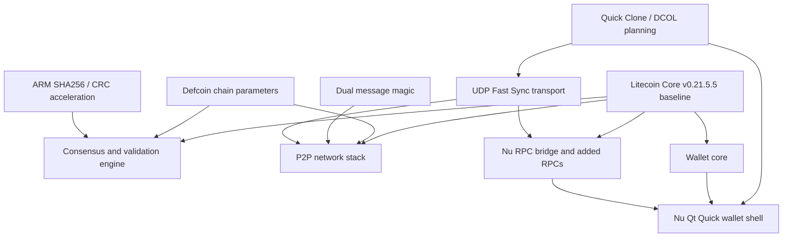

# Defcoin Core Nu Architecture And Upstream Litecoin v0.21.5.5 Comparison

This document compares the current Defcoin Core Nu source tree with the exact
upstream Litecoin Core `v0.21.5.5` tag. It focuses on source-level behavior:
consensus parameters, network identity, transport changes, wallet-facing
additions, and the Nu Qt Quick application layer.

## Executive Summary

Defcoin Core Nu is a Defcoin full-node wallet and desktop application derived
from Litecoin Core v0.21.5.5. It preserves Defcoin's historical chain rules,
peer compatibility, wallet data, and Scrypt proof-of-work network while adding
Nu-specific networking, diagnostics, wallet UX, mining helpers, and packaging.

Core differentiators relative to upstream Litecoin Core v0.21.5.5:

- Defcoin-specific mainnet identity: genesis block, message magic, default
  ports, DNS seeds, address prefixes, Bech32 HRPs, chain work, and soft-fork
  activation boundaries are replaced in `src/chainparams.cpp`.
- Historical Defcoin mainnet rules are prioritized over newer Litecoin mainnet
  activations. Taproot and MWEB are configured as never active on Defcoin
  mainnet, while legacy Defcoin SegWit, CSV, BIP34, BIP65, and BIP66 heights are
  explicit.
- Dual P2P message magic supports migration from legacy `fbc0b6db` peers to
  Defcoin-specific `defc014e` peers without forcing old nodes off the network.
- Peer selection and address relay are hardened for a small Defcoin network by
  preferring Defcoin ports/seeds and filtering non-Defcoin peer pollution.
- `NODE_DEFCOIN_FASTSYNC` service bit 29 advertises optional checksum-protected
  UDP Fast Sync capability without changing consensus.
- Fast Sync is implemented as a transport optimization: Core still selects and
  reserves the peer/block pair, and received blocks still enter the normal Core
  validation path.
- Quick Clone/DCOL is kept separate from Fast Sync. It is the trusted-LAN
  snapshot direction for public chain data only and is intentionally
  manifest-gated before live chainstate replacement.
- Nu adds a Qt Quick desktop shell, bundled backend launch orchestration, RPC
  Console, Debug Log, Metrics, LAN discovery, mining helper UI, wallet recovery
  flows, external block-explorer links, and package staging.
- Apple Silicon builds can use ARM SHA256 and CRC32C intrinsics for validation
  hot paths when the compiler and target support them.

## Consensus And Chain Parameters

The largest consensus-facing fork is `src/chainparams.cpp`. Defcoin Core Nu
keeps the Litecoin/Bitcoin validation framework but swaps the active chain
identity:

- Mainnet proof-of-work target spacing is `2 * 60` seconds with a one-day
  retarget timespan.
- Mainnet subsidy halving interval is `840000`.
- Mainnet SegWit and CSV activate at height `903168`.
- Mainnet BIP34 activates at height `828326` with hash
  `57bae90a3342fac0bae15eb2ac9a8924779984bc301ae67730dfda6df49b203c`.
- Mainnet BIP65 and BIP66 activate at height `1828326`.
- Mainnet Taproot and MWEB deployments are set to never active.
- Mainnet pow limit is
  `00000fffffffffffffffffffffffffffffffffffffffffffffffffffffffffff`.
- Mainnet minimum chain work is
  `0x0000000000000000000000000000000000000000000000000001000000000000`.
- Mainnet default assume-valid is empty, forcing local validation rather than a
  Litecoin inherited assume-valid anchor.

The mainnet identity values are Defcoin-specific:

- Genesis: time `1394002925`, nonce `386295993`, bits `0x1e0ffff0`, reward
  `50 * COIN`.
- Genesis block hash:
  `192047379f33ffd2bbbab3d53b9c4b9e9b72e48f888eadb3dcf57de95a6038ad`.
- Genesis merkle root:
  `7294da28c1b8eeba868388b14e2205874fb512f0ca31c2f583002557175f2c9c`.
- Default mainnet P2P port: `1337`.
- Mainnet legacy magic: `fb c0 b6 db`.
- Mainnet Defcoin-specific magic: `de fc 01 4e`.
- Mainnet Base58 prefixes: pubkey `30`, script `5`, secondary script `50`,
  secret key `176`, xpub `0488b21e`, xprv `0488ade4`.
- Mainnet Bech32 HRPs: `dfc` and `dfcmweb`.

Related files:

- `src/chainparams.cpp`
- `src/chainparams.h`
- `src/chainparamsbase.cpp`
- `src/chainparamsseeds.h`
- `src/consensus/params.h`
- `src/key_io.cpp`
- `src/policy/feerate.h`

## Network Identity, Peer Filtering, And Dual Magic

Nu adds explicit dual-magic support in `src/chainparams.h` and `src/net.cpp`.
`MessageStart()` remains stable for inherited storage paths, while live P2P
transport can choose either `MessageStartDefcoinMagic()` or
`MessageStartLegacyMagic()`.

Inbound message parsing in `V1TransportDeserializer::TrySelectMessageStart()`
accepts the Defcoin-specific magic and, when compatibility is enabled, the
legacy magic. Outbound peer creation prefers the Defcoin-specific magic but
keeps a bounded legacy probe path for old-only Defcoin peers.

Defcoin-specific network adaptations also include:

- Faster DNS seed retry behavior for a smaller live network.
- Explicit-host DNS seed handling, including `host:port` seeds.
- Fixed-seed fallback when peer coverage is low.
- Preferred Defcoin ports including default `1337` and alternate `10332`.
- Address-manager and relay filtering intended to reduce inherited
  Litecoin-family peer pollution.
- LAN/private address relay gating through `-allowlannodediscovery`.

Related files:

- `src/net.cpp`
- `src/net.h`
- `src/net_processing.cpp`
- `src/protocol.h`
- `src/rpc/net.cpp`
- `src/qt/nu/app/NuRpcService.cpp`
- `src/qt/nu/qml/Views/SettingsView.qml`
- `src/qt/nu/qml/Views/MetricsView.qml`

## Fast Sync And Quick Clone

Fast Sync is a UDP-assisted block transfer path for eligible peers. The peer
advertises `NODE_DEFCOIN_FASTSYNC`, the Nu helper negotiates a return path, and
Core still reserves, receives, submits, and validates blocks through normal
validation machinery. TCP remains the fallback.

Quick Clone/DCOL is a separate trusted-LAN workflow for public chain state only.
It must never copy wallet files, keys, configs, peers, bans, RPC cookies, or
address books. The safe direction is a manifest-gated snapshot with explicit
hashes and backend shutdown/replace sequencing.

Related files:

- `src/net_processing.cpp`
- `src/rpc/net.cpp`
- `src/qt/nu/app/NuRpcService.cpp`
- `src/qt/nu/docs/fast-sync-protocol.md`
- `src/qt/nu/docs/quick-clone-status-language.md`

## Wallet And UI Capabilities

Nu organizes the wallet around these main views:

- Home: balances, sync state, wallet lock state, and core node health.
- Send: normal send flow, fee review, transaction details, and signing paths
  exposed through backend RPC.
- Receive: address generation, receive-request history, request details, QR
  display, and request removal.
- Transactions: transaction history, details, copy/export actions, and external
  block-explorer links where configured by the user.
- Wallet: wallet files, backup, BIP39 recovery, SQL/BDB wallet selection,
  compatibility encoding tools, passphrase protection, message signing, watch-only
  addresses, paper wallets, and address book tools.
- Mining: external miner selection, preset pool configuration, command/config
  generation, process start/stop, benchmark runs, and live miner log monitoring.
- RPC Console: single-line JSON-RPC execution plus Debug Log viewing.
- Metrics: backend status, traffic, peers, banned peers, Trippy launch, and
  sync/network diagnostics.
- Settings: network preferences, Quick Clone settings, display preferences,
  update preferences, About, and build notes.

Wallet-sensitive operations such as backup, encryption, passphrase changes,
message signing, message verification, PSBT handling, transaction funding, and
broadcasting remain backend-owned. The frontend presents the workflow and
passes explicit user choices to the RPC bridge.

Related files:

- `src/wallet/*`
- `src/qt/nu/app/NuRpcService.cpp`
- `src/qt/nu/qml/Main.qml`
- `src/qt/nu/qml/Views/WalletView.qml`
- `src/qt/nu/qml/Views/ReceiveView.qml`
- `src/qt/nu/qml/Views/SendView.qml`
- `src/qt/nu/qml/Views/MetricsView.qml`

## Validation Performance And Resource Defaults

Nu keeps consensus validation in C++ Core code but adds platform-specific
performance work:

- `configure.ac` detects ARM CRC32 and ARM SHA256 intrinsics.
- `src/Makefile.am` conditionally builds
  `crypto/libbitcoin_crypto_arm_shani.a` from `crypto/sha256_arm_shani.cpp`.
- `src/crypto/sha256.cpp` wires the ARM SHA256 implementation alongside the
  inherited x86 SSE/AVX/SHA-NI implementations.
- `src/txdb.h` raises the 64-bit `-dbcache` ceiling to `32768` MiB.
- `NuRpcService.cpp` can choose an automatic `-dbcache` launch argument from
  available RAM unless the user already configured one.

## Dependency Map

## Safety Boundaries

- Wallet private material stays in Core wallet storage and backend-owned RPC
  paths. QML must not persist private keys, recovery phrases, wallet passphrases,
  BIP38 passphrases, RPC cookies, or address books.
- Fast Sync and Quick Clone must not bypass normal validation unless the user
  explicitly starts a trusted snapshot workflow.
- External block-explorer links are optional browser launches; Nu must validate
  URL templates and keep transaction/address templates separate.
- Debug, metrics, and mining logs are support surfaces. They must not leak
  wallet secrets.
